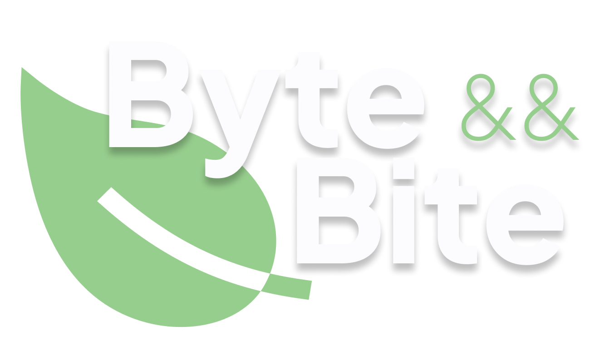

  

#

  
  
  
  
  

<h2>Description</h2>

Byte && Bite is a comprehensive nutritional management platform designed to simplify the tracking of calorie and macronutrient intake. Our primary goal is to empower users through real-time data visualization, enabling informed dietary decisions through an intuitive, clean, and efficient interface.

<h2>Target Audience</h2>

Built for individuals looking to improve their diet, reach weight goals, or simply become more mindful of their daily consumption—all without needing advanced nutritional knowledge.

<h2>Key Features</h2>

<ul style="font-weight: 200">
   <li>Personalized Calorie Control: Track your daily intake with a visual circular progress gauge that compares your current consumption against your daily goal.</li>  
   <li>Macronutrient Tracking: Monitor your water, fat, protein, and carbohydrate intake with detailed and intuitive visual progress bars.</li>  
   <li>Smart Food Logging: Easily search for foods, view nutritional information (kcal per serving), and add them to your daily log with a single tap.</li>
   <li>Profile Management: Store your age, weight, and height to generate fully customized caloric and nutritional targets.</li>  
   <li>Smart Favorites: Save your most-consumed foods in a dedicated bookmark section, filterable by category (proteins, carbs, fats, fruits) for lightning-fast logging.</li>  
   <li>Seamless Access: Sign in securely using traditional methods or fast-track your setup with Google integration to lower the barrier for new users.</li>
</ul>
